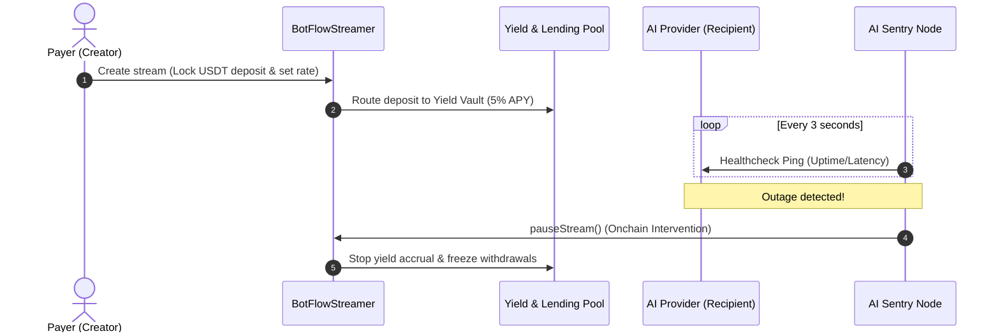

# 🌊 Rheon: Trustless Real-time PayFi Micro-Streaming Protocol

[](https://scan.bohr.life)
[](https://opensource.org/licenses/MIT)

**Rheon** is a premium, real-time **Pay-Per-Second payment streaming and escrow protocol** built natively for the high-speed **BOHR Chain EVM L1**. 

Designed specifically for the AI, GPU DePIN, and machine-to-machine Web3 Knowledge Economy, Rheon leverages BOHR Chain’s sub-second block times (~0.75s) and near-zero fees to unlock continuous micropayments with built-in consumer protections, automatic revenue splits, mock DeFi yield generation, and autonomous watchdog overrides.

---

## 🛑 The Core Problem
As AI agents and GPU rendering DePIN networks proliferate, payment systems remain stuck in Web2 models:
1. **Prepaid Lock-in & Credit Risk:** Users must buy rigid monthly subscriptions or pre-fund API balances, risking losses if the provider suffers an outage or exits.
2. **Capital Inefficiency:** Millions of dollars sit idle in static balances without generating yield for either payers or receivers.
3. **Slow Dispute Resolution:** Refunding users for service outages requires human intervention, taking days or weeks to settle.

## 💡 The Rheon Solution
Rheon shifts the paradigm from prepaid billing to **real-time micro-streaming escrow**:
* Users stream `$USDT` **per second** only while compute is actively being delivered.
* Escrowed funds are routed into a **DeFi Yield Vault** generating interest dynamically.
* An offchain **AI Sentry Node** acts as a decentralized referee, checking the API health every 3 seconds. If the API goes offline, the Sentry Node automatically calls `pauseStream` onchain in **under 1 second**, freezing the flow of capital instantly.

---

## 🏗️ Protocol Architecture



---

## 🌟 Key Features & Innovations

* ⚡ **Pay-Per-Second Micro-Streams:** Pro-rata balance calculations updated on every block. Receivers withdraw accrued earnings in real-time.
* 🛡️ **Autonomous AI Sentry Node Watchdog:** Constantly monitors AI endpoint latency and uptime. Executes high-speed onchain pause interventions the moment an outage occurs.
* 🏦 **Yield & Lending Vault:** Locked escrows dynamically generate a targeted **5% APY**. Users can lock native `$BOT` tokens as collateral (150% coverage) to borrow `$USDT` from this vault at a fixed 10% APR.
* 🏛️ **Decentralized Split Logic:** Streaming revenue is automatically routed onchain: **70%** to the AI Provider, **20%** to the Model Creator, and **10%** to the DAO Treasury.
* ⚖️ **DAO Dispute Resolution:** Allows manual disputes to be resolved through community onchain votes to issue refunds or release funds.
* 💱 **Embedded BDEX Portal:** Provides a glassmorphic automated market maker (AMM) swapper directly inside the console to exchange `$BOT` to `$USDT` gaslessly.

---

## 📋 Deployed Contract Registry (BOHR Chain Testnet)

All smart contracts are deployed and verified on the BOHR Chain block explorer:

| Contract Name | Address | Explorer Link |
| :--- | :--- | :--- |
| **BotFlowStreamer (Core)** | `0x93dEa3e3Ab76cbD15FcB7703170Ed37391f42204` | [Verify on BohrScan](https://scan.bohr.life/address/0x93dEa3e3Ab76cbD15FcB7703170Ed37391f42204) |
| **BotFlowReceipt (ERC-721 NFT)** | `0x8dd6165328d653aff0b68B78C3F3a9734b365Ad9` | [Verify on BohrScan](https://scan.bohr.life/address/0x8dd6165328d653aff0b68B78C3F3a9734b365Ad9) |
| **Mock USDT Token** | `0xa00D072A5A060f48Aa2aF79700a1FaA4140141c6` | [Verify on BohrScan](https://scan.bohr.life/address/0xa00D072A5A060f48Aa2aF79700a1FaA4140141c6) |
| **Bohr DEX Router** | `0xD6425a02f0845B8D99e349C34D2E7A576E177345` | [Verify on BohrScan](https://scan.bohr.life/address/0xD6425a02f0845B8D99e349C34D2E7A576E177345) |
| **Yield & Lending Vault** | `0xCBf8cF8F5cAc904b1fb37379E225F02126DDe879` | [Verify on BohrScan](https://scan.bohr.life/address/0xCBf8cF8F5cAc904b1fb37379E225F02126DDe879) |

---

## 🚀 Quickstart Guide for Judges

### 1. Configure Wallet (BOHR Chain Testnet)
Add BOHR Chain Testnet manually to MetaMask/Rabby:
* **Network Name:** BOHR Chain Testnet
* **RPC URL:** `https://rpc.bohr.life`
* **Chain ID:** `968`
* **Currency Symbol:** `BOT`
* **Block Explorer:** `https://scan.bohr.life/`

### 2. Setup the Repository
Clone the repository and install dependencies at the root workspace:
```bash
git clone https://github.com/mrnetwork0001/BOTflow.git
cd BOTflow
npm install
```

### 3. Start the AI Sentry Node
The Sentry Node acts as the automated network watchdog:
```bash
cd sentry
cp .env.example .env
# Set SENTRY_PRIVATE_KEY and TARGET_API_HEALTH_URL
npm install
npm run dev
```

### 4. Run the Frontend App
Launch the Vite React dashboard console:
```bash
cd ../frontend
cp .env.example .env
npm install
npm run dev
```
Open `http://localhost:3000` to start exploring the console. Use the **Docs** tab inside the dashboard to view technical walk-throughs!

---

*Built with ❤️ for the BOHR Chain Hackathon.*
