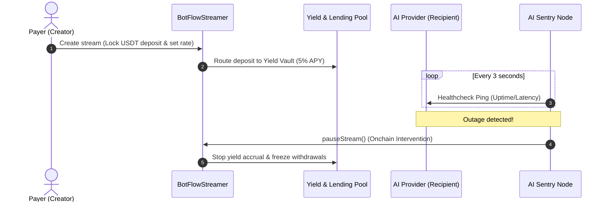

# Rheon: Trustless Real-time PayFi Micro-Streaming Protocol

**Rheon** is a premium, real-time **Pay-Per-Second payment streaming and escrow protocol** built natively for the high-speed **BOTChain EVM L1**. 


Designed specifically for the AI, GPU DePIN, and machine-to-machine Web3 Knowledge Economy, Rheon leverages BOTChain’s sub-second block times (~0.75s) and near-zero fees to unlock continuous micropayments with built-in consumer protections, automatic revenue splits, DeFi yield generation, and autonomous watchdog overrides.

---

## The Core Problem
As AI agents and GPU rendering DePIN networks proliferate, payment systems remain stuck in Web2 models:
1. **Prepaid Lock-in & Credit Risk:** Users must buy rigid monthly subscriptions or pre-fund API balances, risking losses if the provider suffers an outage or exits.
2. **Capital Inefficiency:** Millions of dollars sit idle in static balances without generating yield for either payers or receivers.
3. **Slow Dispute Resolution:** Refunding users for service outages requires human intervention, taking days or weeks to settle.

## The Rheon Solution
Rheon shifts the paradigm from prepaid billing to **real-time micro-streaming escrow**:
* Users stream `$USDT` **per second** only while compute is actively being delivered.
* Escrowed funds are routed into a **DeFi Yield Vault** generating interest dynamically.
* An offchain **AI Sentry Node** acts as a decentralized referee, checking the API health every 3 seconds. If the API goes offline, the Sentry Node automatically calls `pauseStream` onchain in **under 1 second**, freezing the flow of capital instantly.

---

## Protocol Architecture



---

## Key Features & Innovations

* **Pay-Per-Second Micro-Streams:** Pro-rata balance calculations updated on every block. Receivers withdraw accrued earnings in real-time.
* **Autonomous AI Sentry Node Watchdog (24/7 Dedicated VPS):** Hosted 24/7 on an isolated, high-uptime production VPS environment to constantly monitor AI endpoint latency and uptime. Executes high-speed onchain pause interventions the moment an outage occurs.
  

* **Yield & Lending Vault:** Locked escrows dynamically generate a targeted **5% APY**. Users can lock native `$BOT` tokens as collateral (150% coverage) to borrow `$USDT` from this vault at a fixed 10% APR.
* **Decentralized Split Logic:** Streaming revenue is automatically routed onchain: **70%** to the AI Provider, **20%** to the Model Creator, and **10%** to the DAO Treasury.
* **DAO Dispute Resolution:** Allows manual disputes to be resolved through community onchain votes to issue refunds or release funds.
* **Embedded BDEX Portal:** Provides a glassmorphic automated market maker (AMM) swapper directly inside the console to exchange `$BOT` to `$USDT` gaslessly.

---

## Deployed Contract Registry (BOTChain Mainnet)

All smart contracts are deployed and verified on the official BOTChain block explorer:

| Contract Name | Address | Explorer Link |
| :--- | :--- | :--- |
| **BotFlowStreamer (Core)** | `0x4070a987c938a18ceA469e61c4c12eaC600625f0` | [Verify on BOTChain Explorer](https://scan.botchain.ai/address/0x4070a987c938a18ceA469e61c4c12eaC600625f0) |
| **BotFlowReceipt (ERC-721 NFT)** | `0x7177f6c14afFf6E8D1b6331FE8Ab3009057084D7` | [Verify on BOTChain Explorer](https://scan.botchain.ai/address/0x7177f6c14afFf6E8D1b6331FE8Ab3009057084D7) |
| **Tether USD (USDT)** | `0xaBabc7Ddc03e501d190C676BF3d92ef0e6e87a3C` | [Verify on BOTChain Explorer](https://scan.botchain.ai/address/0xaBabc7Ddc03e501d190C676BF3d92ef0e6e87a3C) |
| **RheonSwapRouter (DeFi Analytics)** | `0x485fcab52e7CAF8f3ae5E124c4f2214eb918c349` | [Verify on BOTChain Explorer](https://scan.botchain.ai/address/0x485fcab52e7CAF8f3ae5E124c4f2214eb918c349) |
| **BOTChain DEX Router** | `0x1414eD29FdFD322c3c0a830330ed982E2D629e76` | [Verify on BOTChain Explorer](https://scan.botchain.ai/address/0x1414eD29FdFD322c3c0a830330ed982E2D629e76) |
| **Yield & Lending Vault** | `0x76C574BC7464b28Fa33F0486C922bEc85EB1E207` | [Verify on BOTChain Explorer](https://scan.botchain.ai/address/0x76C574BC7464b28Fa33F0486C922bEc85EB1E207) |

---

## Quickstart Guide for Judges

### 1. Configure Wallet (BOTChain Mainnet)
Add BOTChain Mainnet manually to MetaMask/Rabby:
* **Network Name:** BOTChain Mainnet
* **RPC URL:** `https://rpc.botchain.ai`
* **Chain ID:** `677`
* **Currency Symbol:** `BOT`
* **Block Explorer:** `https://scan.botchain.ai/`

### 2. Setup the Repository
Clone the repository and install dependencies at the root workspace:
```bash
git clone https://github.com/mrnetwork0001/Rheon.git
cd BOTflow
npm install
```

### 3. Start the AI Sentry Node
The Sentry Node acts as the automated network watchdog. *(Note: In production, our Sentry Node watchdog is actively hosted 24/7 on a dedicated Linux VPS to provide permanent real-time stream monitoring. If you wish to run a local instance for development):*
```bash
cd sentry
cp .env.example .env
# Set SENTRY_PRIVATE_KEY and TARGET_API_HEALTH_URL
npm install
npm run dev
```

### 4. Run the Frontend App
Launch the Vite React dashboard console:
```bash
cd ../frontend
cp .env.example .env
npm install
npm run dev
```
Open `http://localhost:3000` to start exploring the console. Use the **Docs** tab inside the dashboard to view technical walk-throughs!

---

*Built with ❤️ for the BOTChain Hackathon.*
